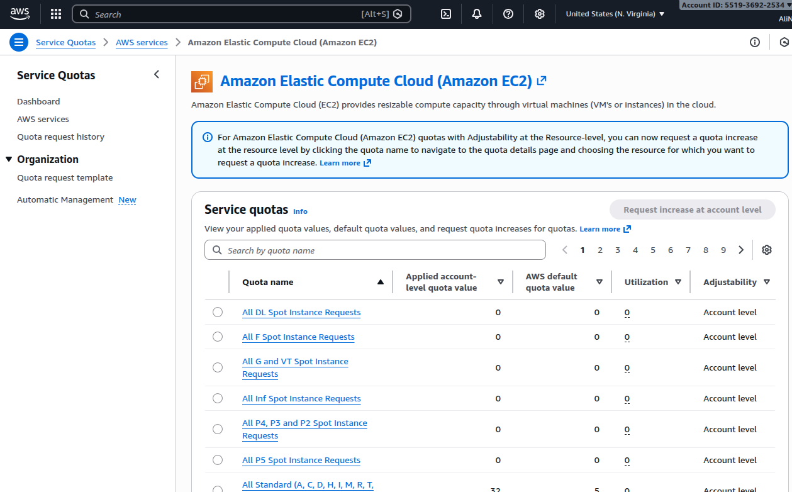

**service quota:** 
In AWS, a service quota (formerly called a limit) is the maximum amount of a specific resource or operation that you can use within an `AWS account for a given service and Region`. 
sometimes you cannot create a studio with big instance or you cannot load a big llm because your service quota and your account level doesn't allow yo uto create that kind of big instance.

Q. how to increase your service quote? 
A. submit a request for a service quota increase

service quota for amazon ec2 service: 
