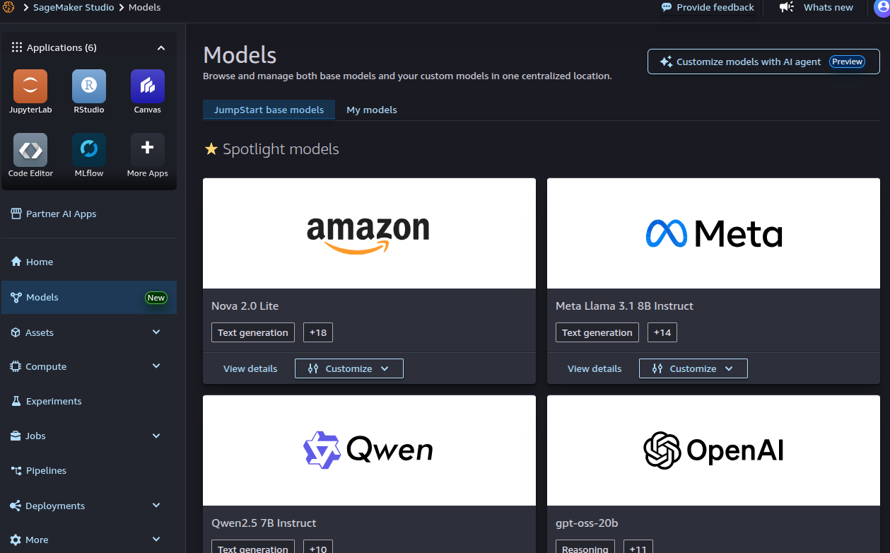

Q. what is main use of sagemaker jumpstart? 
A. SageMaker JumpStart is your gateway to jumpstart developing your machine learning model.
It offers a collection of pre-trained, open-source models and (notebooks using these models) covering a diverse range of problem types.

Q. what policy is necessary to be able to see the models of jumpstart? 
A. AmazonSageMakerFullAccess

Q. I do not see jumpstart on the left-side menu of sagemaker studio. where can I find the list of builtin models and associate models?<br
A. under model option.

